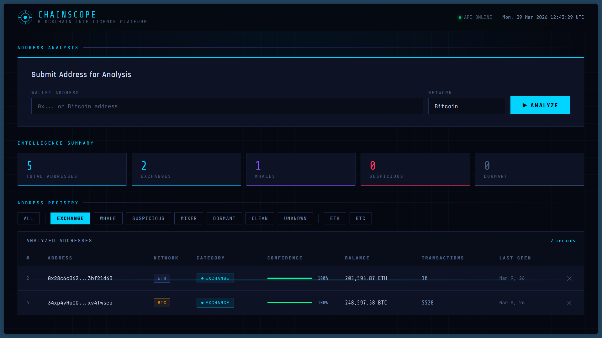
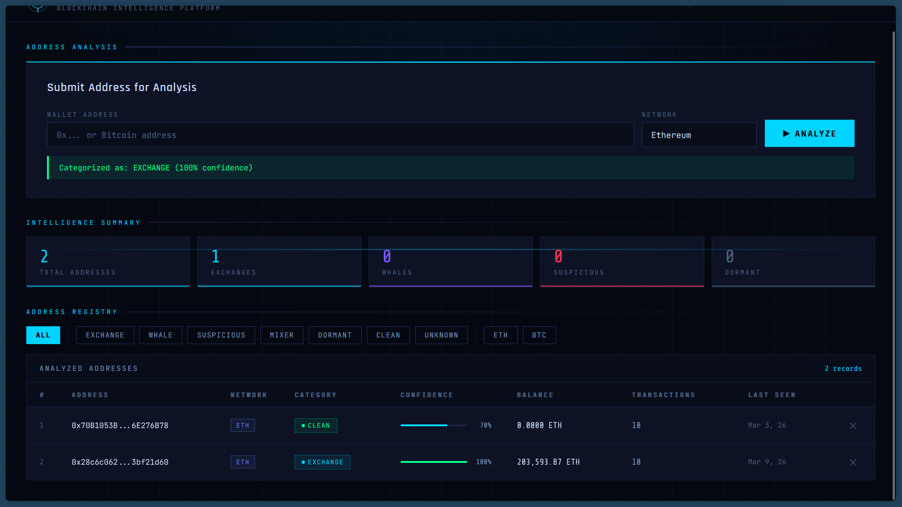
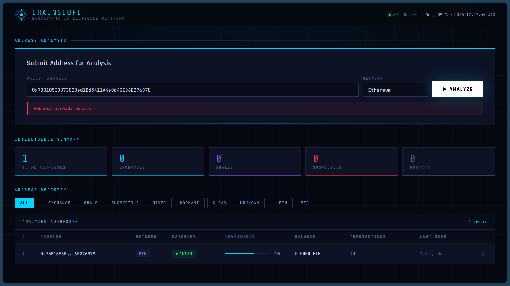

# ChainScope
### See Through the Blockchain.

> A cryptocurrency address intelligence platform that collects, analyzes, and categorizes blockchain wallet addresses using real on-chain data.

**Live Demo:** https://chainscope-qh1s.onrender.com  
**GitHub:** https://github.com/KishorePrabakar/chainscope

---

## Screenshots

### Dashboard — Address Registry

*Filter addresses by category. Exchange filter showing ETH and BTC wallets with 100% confidence scores and real on-chain balances.*

### Live Analysis — Exchange Detection

*Submitting a Binance hot wallet. Instantly categorized as EXCHANGE with 100% confidence.*

### Duplicate Detection

*Re-submitting an already analyzed address returns a 409 conflict error.*

---

## What It Does

ChainScope accepts a cryptocurrency wallet address (Ethereum or Bitcoin), fetches its complete on-chain history from public blockchain APIs, runs it through a categorization rules engine, and stores the result.

**Input:** A wallet address + chain  
**Output:** Category, confidence score, balance, transaction history, timestamps

### Categories

| Category | Description | Confidence |
|----------|-------------|------------|
| `exchange` | Matches known exchange hot wallets (Binance, Coinbase, Kraken) | 100% |
| `whale` | Balance > 1000 ETH or > 100 BTC | 95% |
| `dormant` | No activity in 2+ years | 90% |
| `suspicious` | Unusually high transaction volume | 60% |
| `clean` | Regular activity, no red flags | 70% |
| `unknown` | Insufficient data | 30% |

---

## Architecture

```
User submits address
       ↓
Express REST API (Node.js)
       ↓
Chain detection (0x... = Ethereum, else Bitcoin)
       ↓
Etherscan API (ETH) / Blockchain.info API (BTC)
       ↓
Categorization Rules Engine
       ↓
SQLite Database
       ↓
JSON response → Frontend Dashboard
```

---

## API Reference

### POST `/api/address`
Submit an address for analysis and store the result.

**Request:**
```json
{
  "address": "0x28c6c06298d514db089934071355e5743bf21d60",
  "chain": "ethereum"
}
```

**Response:**
```json
{
  "id": 2,
  "address": "0x28c6c06298d514db089934071355e5743bf21d60",
  "chain": "ethereum",
  "category": "exchange",
  "confidence_score": 1.0,
  "reasons": ["Matches known exchange address"],
  "balance": 203593.87,
  "total_transactions": 10,
  "message": "Address analyzed and stored successfully"
}
```

---

### GET `/api/addresses`
List all analyzed addresses with optional filters.

**Query params:** `?category=exchange&chain=ethereum`

**Response:**
```json
{
  "count": 2,
  "addresses": [...]
}
```

---

### GET `/api/address/:id`
Get full analysis of a stored address by ID.

---

### GET `/api/analyze/:address`
Live on-demand analysis without storing. Auto-detects chain from address format.

---

### DELETE `/api/address/:id`
Remove an address from the registry.

---

## Tech Stack

| Layer | Technology |
|-------|-----------|
| Backend | Node.js + Express |
| Database | SQLite (via sqlite3) |
| ETH Data | Etherscan API v2 |
| BTC Data | Blockchain.info API |
| Frontend | HTML / CSS / JS (single file) |
| Deployment | Render.com |

---

## Setup

### Prerequisites
- Node.js v18+
- Etherscan API key (free at etherscan.io/register)

### Installation

```bash
git clone https://github.com/KishorePrabakar/chainscope
cd chainscope
npm install
```

### Environment Variables

Create a `.env` file in the project root:

```
ETHERSCAN_API_KEY=your_key_here
```

### Run

```bash
node src/server.js
```

Open `http://localhost:3000`

---

## Sample Addresses to Test

**Ethereum:**
| Address | Expected Category |
|---------|------------------|
| `0x28c6c06298d514db089934071355e5743bf21d60` | exchange (Binance) |
| `0xf977814e90da44bfa03b6295a0616a897441acec` | exchange (Binance) |
| `0xAb5801a7D398351b8bE11C439e05C5B3259aeC9B` | whale (Vitalik) |
| `0x21a31ee1afc51d94c2efccaa2092ad1028285549` | exchange (Binance) |

**Bitcoin:**
| Address | Expected Category |
|---------|------------------|
| `34xp4vRoCGJym3xR7yCVPFHoCNxv4Twseo` | exchange (Binance) |
| `3Cbq7aT1tY8kMxWLbitaG7yT6bPbKChq64` | exchange (Coinbase) |
| `1FeexV6bAHb8ybZjqQMjJrcCrHGW9sb6uF` | whale (dormant) |

---

## Project Structure

```
chainscope/
├── src/
│   ├── server.js              # Express app entry point
│   ├── database.js            # SQLite connection + schema
│   ├── controllers/
│   │   ├── addressController.js   # POST, GET, DELETE endpoints
│   │   └── analyzeController.js   # Live analysis endpoint
│   ├── routes/
│   │   └── addressRoutes.js       # Route definitions
│   └── utils/
│       ├── etherscan.js           # Etherscan API fetcher
│       ├── blockchain.js          # Blockchain.info fetcher
│       └── categorizer.js         # Rules engine
├── public/
│   └── index.html             # Frontend dashboard
├── .env                       # API keys (not committed)
├── .gitignore
├── package.json
└── README.md
```

---

## Team

| Name | GitHub | Role |
|------|--------|------|
| Kishore Prabakar | [@KishorePrabakar](https://github.com/KishorePrabakar) | Backend — server, endpoints, categorization engine, deployment |
| Nithish Chandrasekaran | [@NITHISH-2006](https://github.com/NITHISH-2006) | Backend — blockchain API fetchers, live analysis, frontend |

**Problem Statement:** SIH25228  
**Organization:** NTRO (National Technical Research Organisation)

---

## Known Limitations

- `total_transactions` is capped at 10 due to Etherscan free tier pagination limit
- SQLite resets on Render free tier redeploys (data stored in `/tmp`)
- Bitcoin address detection uses length heuristic — may misclassify some edge cases
- Mixer and suspicious categories require transaction pattern analysis not yet implemented

---

## Roadmap

- [ ] Fund flow tracing (3-hop recursion)
- [ ] OFAC/Chainabuse blacklist integration  
- [ ] Risk scoring 0–100
- [ ] Batch address submission
- [ ] Transaction graph visualization (Cytoscape.js)
- [ ] PostgreSQL migration for persistent production storage